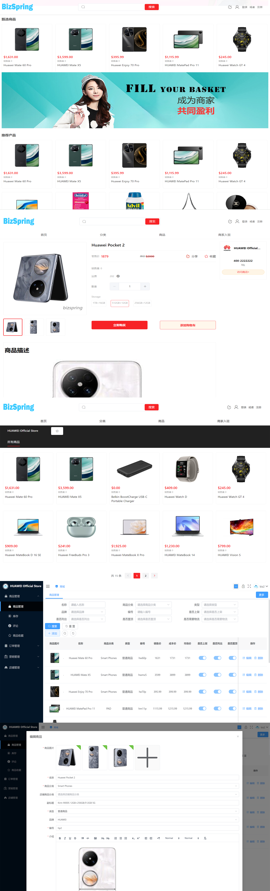

BizSpring电商平台基于Spring Cloud构建，结合了Nacos、MySQL、Redis和Elasticsearch等技术。平台注重最新技术和用户体验，采用现代设计理念提供流畅的用户界面。强调系统的可扩展性和稳定性，支持集群部署，确保高并发访问下的稳定运行。无论是小型企业还是大型集团都能享受高效可靠的服务。  
	项目源代码完全开放，降低了定制开发的成本和难度，适合快速搭建电商平台的企业。功能覆盖拼团购物、限时抢购、优惠券管理、积分兑换和网络分销等多种电商需求，帮助企业吸引顾客、提升销售额并优化客户关系，实现商业价值最大化。

## <font style="color:rgb(60, 60, 67);">开源文档</font>
[http://docs.bizspring.cn](http://docs.bizspring.cn)

## <font style="color:rgb(60, 60, 67);">BizSpring开源项</font><font style="color:rgb(64, 72, 91);">目链接</font>
#### <font style="color:rgb(60, 60, 67);">Github</font>
<font style="color:rgb(60, 60, 67);">数据库（微服务商城）</font>

[https://github.com/bizspring-mall/BizSpring-Web-Mall](https://github.com/bizspring-mall/BizSpring-Web-Mall)[.git](https://github.com/bizspring-mall/BizSpring-Cross-Border-Mall.git)

<font style="color:rgb(60, 60, 67);">VUE3页面（跨境电商）</font>

[https://github.com/bizspring-mall/BizSpring-Cross-Border-Mall.git](https://github.com/bizspring-mall/BizSpring-Cross-Border-Mall.git)

<font style="color:rgb(60, 60, 67);">微服务后台（Java商城）</font>

[https://github.com/bizspring-open/BizSpring-Java-Mall.git](https://github.com/bizspring-open/BizSpring-Java-Mall.git)

移动商城

[https://github.com/bizspring-code/BizSpring-Mobile-Mall.git](https://github.com/bizspring-code/BizSpring-Mobile-Mall.git)

小程序商城

[https://github.com/bizspring-code/BizSpring-Applet-Mall.git](https://github.com/bizspring-code/BizSpring-Applet-Mall.git)

微服务商城

[https://github.com/bizspring-open/BizSpring-Cloud-Mall](https://github.com/bizspring-open/BizSpring-Cloud-Mall)[.git](https://github.com/bizspring-code/BizSpring-Applet-Mall.git)

#### <font style="color:rgb(60, 60, 67);">Gitee</font>
<font style="color:rgb(60, 60, 67);">数据库（微服务商城）</font>

[https://gitee.com/bizSpring_mall/BizSpring-Cloud-Mall.git](https://gitee.com/bizSpring_mall/BizSpring-Cloud-Mall.git)

<font style="color:rgb(60, 60, 67);">VUE3页面（跨境电商）</font>

[https://gitee.com/BizSpringOpen/BizSpring-Cross-Border-Mall.git](https://gitee.com/BizSpringOpen/BizSpring-Cross-Border-Mall.git)

<font style="color:rgb(60, 60, 67);">微服务后台（Java商城）</font>

[https://gitee.com/bizSpring_mall/bizspring-java-mall.git](https://gitee.com/bizSpring_mall/bizspring-java-mall.git)

移动商城

[https://gitee.com/BizSpring-Source-Code/BizSpring-Mobile-Mall.git](https://gitee.com/BizSpring-Source-Code/BizSpring-Mobile-Mall.git)

小程序商城

[https://gitee.com/BizSpring-Source-Code/BizSpring-Applet-Mall.git](https://gitee.com/BizSpring-Source-Code/BizSpring-Applet-Mall.git)

## <font style="color:rgb(64, 72, 91);">系统展示</font>


# 体验地址
| 系统 | H5二维码 | APP下载 | H5 URL | PC URL |
| --- | --- | --- | --- | --- |
| 商城 |  |   | [https://shop.bizspring.cn/shop/#](https://shop.bizspring.cn/shop/#) | [https://shop.bizspring.cn/pc/#](https://shop.bizspring.cn/pc/#) |
| 商家 |  |  | [https://shop.bizspring.cn/merchant/#](https://shop.bizspring.cn/merchant/#) | [https://shop.bizspring.cn/biz/#](https://shop.bizspring.cn/biz/#) |
| 管理 | [https://shop.bizspring.cn](https://shop.bizspring.cn) |  | [https://shop.bizspring.cn](https://shop.bizspring.cn) | [https://shop.bizspring.cn](https://shop.bizspring.cn) |


## 
**部署所需软硬件及网络环境**

| **序号** | **参数** | **最低配置** |
| --- | --- | --- |
| <font style="color:rgb(60, 60, 67);">1</font> | <font style="color:rgb(60, 60, 67);">服务器</font> | <font style="color:rgb(60, 60, 67);">2核CPU 8G内存+</font> |
| <font style="color:rgb(60, 60, 67);">2</font> | <font style="color:rgb(60, 60, 67);">操作系统</font> | <font style="color:rgb(60, 60, 67);">window service 2008 / CentOS 7.9、Ubuntu 16、Alibaba Cloud ...</font> |
| <font style="color:rgb(60, 60, 67);">3</font> | <font style="color:rgb(60, 60, 67);">网络带宽</font> | <font style="color:rgb(60, 60, 67);">5M 带宽+</font> |
| <font style="color:rgb(60, 60, 67);">4</font> | <font style="color:rgb(60, 60, 67);">数据库系统</font> | <font style="color:rgb(60, 60, 67);">Mysql 8.0+</font> |
| <font style="color:rgb(60, 60, 67);">5</font> | <font style="color:rgb(60, 60, 67);">备案域名数</font> | <font style="color:rgb(60, 60, 67);">1</font> |
| <font style="color:rgb(60, 60, 67);">6</font> | <font style="color:rgb(60, 60, 67);">缓存</font> | <font style="color:rgb(60, 60, 67);">Redis 5.0+</font> |
| <font style="color:rgb(60, 60, 67);">7</font> | <font style="color:rgb(60, 60, 67);">JDK</font> | <font style="color:rgb(60, 60, 67);">1.8+</font> |
| <font style="color:rgb(60, 60, 67);">8</font> | <font style="color:rgb(60, 60, 67);">网络组件</font> | <font style="color:rgb(60, 60, 67);">Nginx 1.20+</font> |
| <font style="color:rgb(60, 60, 67);">9</font> | <font style="color:rgb(60, 60, 67);">Maven</font> | <font style="color:rgb(60, 60, 67);">3.6+</font> |
| <font style="color:rgb(60, 60, 67);">10</font> | <font style="color:rgb(60, 60, 67);">Node Js</font> | <font style="color:rgb(60, 60, 67);">node14.18+</font> |


## <font style="color:rgb(64, 72, 91);">授权</font>
<font style="color:rgb(64, 72, 91);">除开源版本外，本商城还提供商业版本的商城，欲知详情，请访问官网。</font>

<font style="color:rgb(64, 72, 91);">商城官网：</font>[<font style="color:rgb(9, 94, 171);">https://www.bizspring.c</font>](https://gitee.com/link?target=https%3A%2F%2Fwww.mall4j.com)<font style="color:rgb(9, 94, 171);">n</font>

<font style="color:rgb(64, 72, 91);">商城使用 AGPLv3 开源，请遵守 AGPLv3 的相关条款.</font>

## <font style="color:rgb(64, 72, 91);">  
</font><font style="color:rgb(64, 72, 91);">代码目录结构</font>
本项目严格遵循了阿里巴巴的代码规约，确保了代码的质量、可读性和维护性。以保证每一行代码都符合阿里巴巴制定的最佳实践标准.

1. **命名规范**：所有变量、函数、类等命名均采用了有意义且易于理解的名字，并按照阿里编码指南中的推荐格式进行书写。
2. **注释与文档**：重要逻辑部分均有清晰的注释说明；公共方法和类提供了详尽的Javadoc或等效文档描述。
3. **代码结构**：保持了良好的模块化设计，每个文件只负责单一功能，避免了冗长复杂的单个文件出现。
4. **异常处理**：对于可能出现错误的情况，实现了适当的异常捕获机制，并给出了合理的错误信息反馈。
5. **性能优化**：尽量减少了不必要的资源消耗，比如避免了循环中重复计算等常见问题。
6. **安全性考量**：特别注意了数据验证和安全漏洞防护，如SQL注入攻击防范等 。 同时大部分现有代码已经很好地达到了高质量的标准。未来，我们将持续关注这些指标，不断优化和完善我们的软件开发流程，以提供更加稳定可靠的产品给用户。

```plain
# 项目管理平台-前端vue代码结构说明书

bizspring-admin-vue3-i18n/  //管理平台-前端vue
├── public/  //公共文件夹
│   └── config.js  //后台服务URL配置接口
├── src/
│   ├── api/  //管理平台vue接口文件夹
│   │   ├── gen/  //代码生成API包
│   │   ├── goods/  //商品管理API包
│   │   ├── marketing/  //促销管理API包
│   │   ├── order/  //订单管理API包
│   │   ├── store/  //店铺管理API包
│   │   ├── upms/  //平台管理API包
│   │   ├── i18n.js  //多语言API接口
│   │   └── login.js  //登录API接口
│   ├── assets/  //资源文件夹
│   ├── components/  //组件文件夹
│   ├── const/  //平台管理页面数据配置
│   ├── page/  //框架页面文件夹
│   │   ├── index/  //主页文件夹
│   ├── router/  //路由包
│   ├── store/  //vue store包
│   ├── styles/  //主页主题相关
│   ├── utils/  //工具类
│   ├── views/  //页面文件夹
│   │   ├── goods/  //商品页面文件夹
│   │   ├── marketing/  //促销页面文件夹
│   │   ├── order/  //订单页面文件夹
│   │   ├── store/  //店铺页面文件夹
│   │   ├── tool/  //代码生成页面文件夹
│   │   └── upms/  //平台管理页面文件夹
│   ├── App.vue
│   ├── main.js
├── vite/
└── vite.config.js

```


# 体验地址
| 系统 | H5二维码 | APP下载 | H5 URL | PC URL |
| --- | --- | --- | --- | --- |
| 商城 |  |   | [https://shop.bizspring.cn/shop/#](https://shop.bizspring.cn/shop/#) | [https://shop.bizspring.cn/pc/#](https://shop.bizspring.cn/pc/#) |
| 商家 |  |  | [https://shop.bizspring.cn/merchant/#](https://shop.bizspring.cn/merchant/#) | [https://shop.bizspring.cn/biz/#](https://shop.bizspring.cn/biz/#) |
| 管理 | [https://shop.bizspring.cn](https://shop.bizspring.cn) |  | [https://shop.bizspring.cn](https://shop.bizspring.cn) | [https://shop.bizspring.cn](https://shop.bizspring.cn) |


# 实施及售后
## <font style="color:rgb(64, 72, 91);">部署教程</font>
[https://docs.bizspring.cn/develop/deploy/%E5%BC%80%E5%8F%91%E7%8E%AF%E5%A2%83%E9%83%A8%E7%BD%B2-OPEN(develop-deploy-open).html](https://docs.bizspring.cn/develop/deploy/%E5%BC%80%E5%8F%91%E7%8E%AF%E5%A2%83%E9%83%A8%E7%BD%B2-OPEN(develop-deploy-open).html)


### 安装前准备
我方提供电商平台的部署实施工作，客户需要准备的硬件环境，软件环境，网络环境，见部署准备文档

### 售后内容
**技术支持**

1. 系统操作：我们提供软件各端操作说明，包括商城、商家、管理软件功能及系统说明、常见问题解决等。以帮助用户更好地使用系统。
2. 技术支持：提供7*12（9:00-21:00）小时技术咨询，解决用户在使用过程中遇到的技术问题，包括软件故障、配置问题等。

**软件升级及漏洞修复**

1. 软件升级：BizSpring产品终生迭代升级，正常付费的客户联系客服确定升级不影响系统业务后，我方技术人员提供升级服务，确保客户软件保持最新版本，具备最新的功能和性能。
2. 漏洞修复：客户发现影响使用的系统漏洞、缺陷、业务需求等，提交我方售后客服。我方定期做评估，进行修复、确保软件的安全性和稳定性。

**客户支持及反馈接收**

+ 客户支持：为进一步提升我产品各方面体验，建立客户支持渠道，收集系统缺陷、更新需求和解答用户的问题和疑虑，提高用户满意度。

## 技术服务
+ 销售-阿真 微信号： 16619915737
+ QQ技术交流群： 576790917

## <font style="color:rgb(64, 72, 91);">您的点赞鼓励，是我们继续前进的动力~</font>
## <font style="color:rgb(64, 72, 91);">您的点赞鼓励，是我们继续前进的动力~</font>
## <font style="color:rgb(64, 72, 91);">您的点赞鼓励，是我们继续前进的动力~</font>
